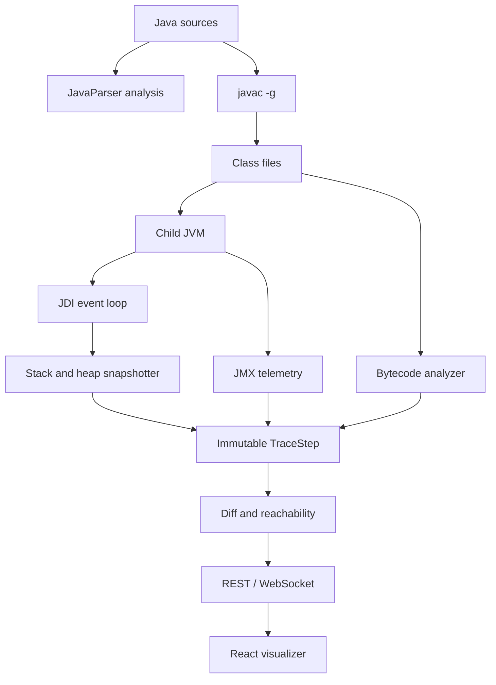

# Architecture

## Session ownership

`ExecutionSession` owns the compiled output directory, live JDI VM handle, logical object registry, command queue, console history, and immutable trace history. Only the debugger event loop mutates the live execution state. UI history navigation reads prior snapshots and never asks the JVM to run backward.

## Suspension protocol

1. The launch connector starts the child VM suspended.
2. A filtered `ClassPrepareRequest` waits for the requested main class.
3. The engine places a breakpoint at the first executable location in `main`.
4. On each suspension, the engine observes stack, locals, reachable objects, user-class statics, bytecode, console, and memory telemetry.
5. The engine publishes the snapshot and waits for `INTO`, `OVER`, `OUT`, or `STOP`.
6. The next one-shot `StepRequest` is installed and the VM resumes.

## Heap graph

Visible locals and `this` references are tracked roots. Arrays and instance fields are traversed recursively with `maxDepth`, `maxObjects`, and `maxArrayElements` bounds. Static reference fields are additional roots for loaded user types. Reachability means “reachable from these tracked roots,” not global proof of GC reachability.

## Evidence

- `OBSERVED`: provided directly by JDI or JMX for the child JVM.
- `DERIVED`: computed from observed data, such as edges, diffs, and tracked reachability.
- `SIMULATED`: the educational per-object generational model.

## Extension points

- JFR monitor for allocation samples, GC pauses, class loading, and contention
- Child-side JOL probe for runtime object-layout queries
- JVMTI tagging, `ObjectFree`, heap traversal, and stronger root paths
- Collection-specific educational renderers while preserving the generic renderer
- Multi-file editor and package-aware source filters

