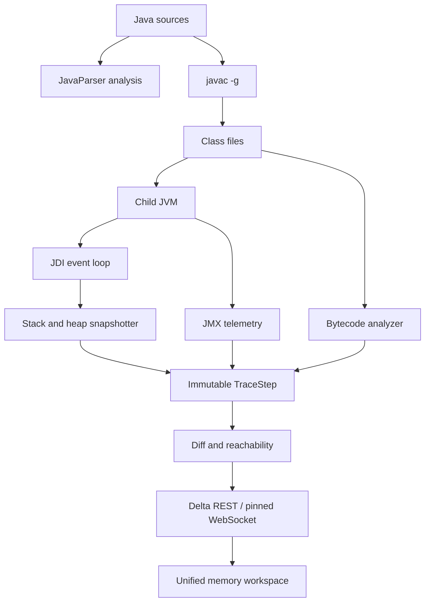

# Architecture

```mermaid
flowchart TD
  A[Java sources] --> B[JavaParser analysis]
  A --> C[javac -g]
  C --> D[Class files]
  D --> E[Child JVM]
  D --> F[Bytecode analyzer]
  E --> G[JDI event loop]
  E --> H[JMX telemetry]
  G --> I[Stack and heap snapshotter]
  I --> J[Immutable TraceStep]
  F --> J
  H --> J
  J --> K[Diff and reachability]
  K --> L[Delta REST / pinned WebSocket]
  L --> M[Unified memory workspace]
```

## Session ownership

`ExecutionSession` owns the compiled output directory, live JDI VM handle, logical object registry, command queue, and a bounded trace deque. Only the debugger event loop mutates live execution state. A session is pinned to one WebSocket connection when available so start and step commands reach the same backend instance. REST delta polling remains a fallback.

Completed sessions expire after a configurable TTL. Cleanup removes the session, terminates remaining child VMs during shutdown, clears bytecode cache entries, closes JMX connectors, and deletes the exact session temporary directory.

## Suspension protocol

1. The launch connector starts the child VM suspended.
2. A filtered `ClassPrepareRequest` waits for the requested main class.
3. The engine places a breakpoint at the first executable location in `main`.
4. On each suspension, the engine observes all suspended user-thread stacks, locals, reachable objects, tracked user-class statics, method-scoped bytecode, console, and sampled memory telemetry.
5. The engine publishes the snapshot and waits for `INTO`, `OVER`, `OUT`, or `STOP`.
6. The next one-shot `StepRequest` is installed and the VM resumes.

## Heap graph

Visible locals and `this` references are tracked roots. Arrays and instance fields are traversed recursively with `maxDepth`, `maxObjects`, and `maxArrayElements` bounds. Static reference fields are additional roots for loaded user types. Reachability means “reachable from these tracked roots,” not global proof of GC reachability.

## Evidence

- `OBSERVED`: provided directly by JDI or JMX for the child JVM.
- `DERIVED`: computed from observed data, such as edges, diffs, and tracked reachability.
- `SIMULATED`: a teaching inference that cannot be proven from the current debugger evidence, such as an initial race candidate.

## Extension points

- JFR monitor for allocation samples, GC pauses, class loading, and contention
- Child-side layout probe for runtime object-layout queries
- JVMTI tagging, `ObjectFree`, heap traversal, and stronger root paths
- Collection-specific educational renderers while preserving the generic renderer
- Multi-file editor and package-aware source filters
